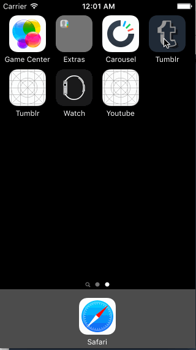

# CodePath Week-4 Tumblr

This is the CodePath for iOS Designers course, weeek 4 assignment for the Tumblr application. Apply for the iOS for Designers CodePath course here: http://codepath.com/iosfordesigners.

+ Time Spent: 7 hours

## Completed User Stories

+ *[x] Tapping on Home, Search, Account, or Trending should show the respective screen and highlight the tab bar button.
+ *[x] Compose button should modally present the compose screen.
+ *[ ] Optional: Compose screen is faded in while the buttons animate in.
+ *[ ] Optional: Login button should show animate the login form over the view controller.
+ *[ ] Optional: Discover bubble should bob up and down unless the SearchViewController is tapped.

